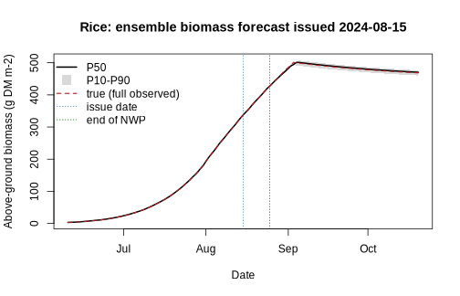
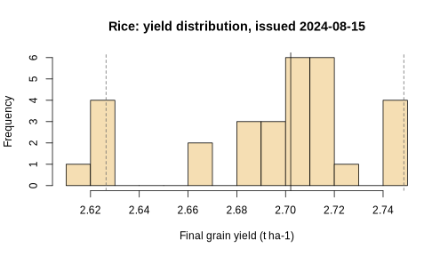
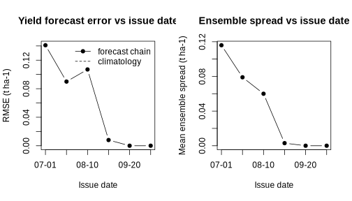

## 1. 先把问题说清楚：你描述的到底是什么

你的直觉里其实混着**两条不同的曲线**，拆开就清楚了：

- **曲线 A（单次预报之内）**：在某一天发布预报，预测"未来第 1 天、第 2 天、……
  第 30 天"的生物量。离现在越远，不确定性越大——**天气预报的技巧随提前期
  衰减**，这是 NWP 本身的性质，降水尤其如此（2～3 天后技巧快速下降，
  温度可达 7～10 天）。
- **曲线 B（滚动预报之间）**：在拔节期、抽穗期、灌浆期**分别**发布对"最终
  产量"的预报。随着季节推进，预报**越来越准**——这是一个滚动更新的动态
  产量预报系统，也是本 vignette 要搭建和验证的东西。

两条曲线不矛盾：曲线 A 说的是"一份预报内部越往后越不准"；曲线 B 说的是
"越临近收获，产量预报越准"。后者成立靠两个机制：

1. **实测替换**：发布日期越靠后，已被实测天气替换掉的季节比例越高，到收获
   时 100% 是实测，不确定性只剩模型本身；
2. **区间缩短**：剩下的未知天气越少，它对最终产量的积分贡献越小。

所以答案是：**是的，最终产量会越报越准**（收敛），但有三个前提/注意事项，
见第 5 节。

## 2. 三段式天气链

一次集合预报 = 把完整季节的天气拼成三段，喂给 `spacsys_lite_run()`：

```
播种/移栽                                    收获
   |--- 实测天气 ---|--- NWP 预报(7-10天) ---|--- 情景集合 ---|
                   D                        D+K
                   发布日
```

- **实测段**：发布日 D 之前的真实观测；
- **NWP 段**：未来 K 天的数值天气预报（本 vignette 用 `synthetic_nwp()`
  模拟——给真实未来天气加上随提前期增大的误差；实际业务中换成 CMA /
  ECMWF / Open-Meteo 的 `temperature_2m_max/min`、`precipitation_sum` 即可）；
- **情景段**：NWP 视界之外的剩余季节，从历史年份借整段天气
  （`tail_scenarios()` 的相似年重采样，保留真实天气的时间结构），每个成员
  借一年 → 30 个成员 = 30 种可能的"剩余季节"。

每个成员跑一遍 lite 模型 → 得到地上生物量（叶+茎+籽粒）轨迹的
P10/P50/P90 包络和最终产量的概率分布。**不要只报单值，要报分布。**

## 3. 合成多年代谢天气（演示用）


``` r
gen_hist_weather <- function(start = "2015-01-01", end = "2026-12-31",
                             tmean = 16.8, tamp = 13.2, seed = 2026) {
  dates <- seq(as.Date(start), as.Date(end), by = "day")
  n <- length(dates); doy <- as.integer(format(dates, "%j"))
  set.seed(seed)
  tcyc <- tmean + tamp * cos(2 * pi * (doy - 200) / 365)  # 7月下旬最热
  ar <- as.numeric(stats::filter(rnorm(n, 0, 2.2), 0.72,
                                 method = "recursive"))
  ar[is.na(ar)] <- 0
  tavg <- tcyc + ar
  seas <- cos(2 * pi * (doy - 200) / 365)                 # 夏季为正
  p01 <- 0.30 + 0.06 * seas                              # 干->湿（冬季 ~0.24）
  p11 <- 0.58 + 0.14 * seas                              # 湿->湿（冬季 ~0.44）
  wet <- logical(n); wet[1] <- runif(1) < 0.3
  u <- runif(n)
  for (i in 2:n) wet[i] <- u[i] < ifelse(wet[i - 1], p11[i], p01[i])
  amt_mean <- pmax(5.5 + 4.0 * seas, 3.5)                # 湿日平均降水：冬季 ~3.5 mm，夏季 ~9.5 mm
  precip <- ifelse(wet, rgamma(n, shape = 0.9, scale = amt_mean / 0.9), 0)
  tmax <- tavg + 4.2 + rnorm(n, 0, 0.6)
  tmin <- tavg - 3.8 + rnorm(n, 0, 0.6)
  tmin <- pmin(tmin, tmax - 0.5)
  data.frame(date = dates, tmax = round(tmax, 1), tmin = round(tmin, 1),
             precip = round(precip, 1))
}
hist <- gen_hist_weather()
range(hist$date)
#> [1] "2015-01-01" "2026-12-31"
```

土壤、作物参数与施肥（日期随年份平移，hindcast 时必需）：


``` r
soil <- soil_init(depth_mm = c(200, 300, 500), soc = c(2500, 1500, 800))
rice <- crop_default_params("rice")
fert_rice <- function(py) data.frame(
  date    = as.Date(paste0(py, "-", c("06-18", "07-16", "08-22"))),
  nh4_add = c(4.5, 3, 3), no3_add = c(0, 0, 0))
```

## 4. 单期集合预报演示：水稻

取 2024 年稻季（6-10 移栽至收获），在 8 月 15 日发布预报：


``` r
py <- 2024
season <- season_slice(hist, py, "06-10", "10-20")
issue <- as.Date("2024-08-15")
obs <- season[season$date <= issue, ]
fut <- season[season$date > issue, ]          # 演示用"上帝视角"的真实未来
set.seed(1)
nwp <- synthetic_nwp(fut, horizon = 10)       # 退化成 10 天预报
tails <- tail_scenarios(hist, py, "06-10", "10-20",
                        tail_start = max(nwp$date) + 1,
                        n_ens = 30, seed = 2)
ens <- forecast_yield_ensemble(obs, nwp, tails, soil, crop = rice,
                               n_inputs = fert_rice(py), lat_deg = 32,
                               ponding = list(target_mm = 40))
y <- ens$yield
round(c(mean_t_ha = y$mean_t_ha, sd = y$sd / 100,
        p10 = y$p10 / 100, p50 = y$p50 / 100, p90 = y$p90 / 100), 2)
#> mean_t_ha        sd   p10.10%   p50.50%   p90.90% 
#>      2.69      0.04      2.63      2.70      2.75
```

地上生物量扇形图（顺手用全程实测跑一遍"真值"做参照——注意这是
perfect-model 演示，不是真实验证）：


``` r
true_run <- spacsys_lite_run(season, soil, crop = rice,
                             n_inputs = fert_rice(py), lat_deg = 32,
                             ponding = list(target_mm = 40))
true_agb <- true_run$w_leaf + true_run$w_stem + true_run$w_grain
d <- ens$agb$date
plot(d, ens$agb$p50, type = "n", ylim = range(c(ens$agb$p10, ens$agb$p90)),
     xlab = "Date", ylab = "Above-ground biomass (g DM m-2)",
     main = "Rice: ensemble biomass forecast issued 2024-08-15")
polygon(c(d, rev(d)), c(ens$agb$p10, rev(ens$agb$p90)),
        col = "grey85", border = NA)
lines(d, ens$agb$p50, lwd = 2)
lines(true_run$date, true_agb, col = "firebrick", lwd = 1.5, lty = 2)
abline(v = issue, lty = 3, col = "steelblue")
abline(v = max(nwp$date), lty = 3, col = "darkgreen")
legend("topleft", c("P50", "P10-P90", "true (full observed)",
                    "issue date", "end of NWP"),
       lty = c(1, NA, 2, 3, 3), lwd = c(2, NA, 1.5, 1, 1),
       pch = c(NA, 15, NA, NA, NA),
       col = c("black", "grey85", "firebrick", "steelblue", "darkgreen"),
       pt.cex = 2, bty = "n")
```



看点：发布日之前集合离散度为 0（全是实测）；NWP 窗口内依然很窄；
**扇形在情景段才张开**——剩余季节的不确定性几乎全来自 NWP 视界之外。
这正是"曲线 A"的形状。

产量分布：


``` r
hist(y$values / 100, breaks = 12, col = "wheat",
     xlab = "Final grain yield (t ha-1)",
     main = "Rice: yield distribution, issued 2024-08-15")
abline(v = c(y$p10, y$p50, y$p90) / 100, lty = c(2, 1, 2),
       col = c("grey40", "black", "grey40"))
```



## 5. 小麦同样做法（一期演示）


``` r
wheat <- crop_default_params("wheat")
fert_wheat <- function(py) data.frame(
  date    = as.Date(c(paste0(py, "-", "10-25"),
                      paste0(py + 1, "-", "03-15"))),
  nh4_add = c(5, 4), no3_add = c(0, 0))
pyw <- 2023
sw <- season_slice(hist, pyw, "10-15", "06-15")   # 跨年季节
issuew <- as.Date("2024-03-20")
obsw <- sw[sw$date <= issuew, ]; futw <- sw[sw$date > issuew, ]
set.seed(3)
nwpw <- synthetic_nwp(futw, horizon = 10)
tailsw <- tail_scenarios(hist, pyw, "10-15", "06-15",
                         tail_start = max(nwpw$date) + 1,
                         n_ens = 30, seed = 4)
ensw <- forecast_yield_ensemble(obsw, nwpw, tailsw, soil, crop = wheat,
                                n_inputs = fert_wheat(pyw), lat_deg = 32)
yw <- ensw$yield
round(c(mean_t_ha = yw$mean_t_ha, p10 = yw$p10 / 100,
        p50 = yw$p50 / 100, p90 = yw$p90 / 100), 2)
#> mean_t_ha   p10.10%   p50.50%   p90.90% 
#>      4.22      2.62      4.64      4.97
```

框架与作物无关：换 `crop_default_params("wheat")`、换季节窗口即可。

## 6. Hindcast：产量预报真的越报越准吗？

留一年交叉验证：每年先用**全程实测**跑出"真值"产量（perfect-model，
只检验预报链设计），再在 6 个日期分别按第 2 节的链做集合预报，
比较集合均值与真值。用 2019–2026 年 8 个稻季：


``` r
hist8 <- hist[hist$date >= as.Date("2019-01-01"), ]
hind <- hindcast_experiment(hist8, "06-10", "10-20",
  issue_mds = c("07-01", "07-20", "08-10", "08-30", "09-20", "10-10"),
  n_ens = 20, horizon = 10, soil = soil, crop = rice,
  n_inputs = fert_rice, lat_deg = 32,
  ponding = list(target_mm = 40), seed = 100)
sk <- hindcast_skill(hind)
num <- sapply(sk, is.numeric)
sk[num] <- round(sk[num], 3)
print(sk)
#>   issue_md issue_order n_years  rmse   bias   mae mean_spread rmse_clim skill
#> 1    07-01           1       8 0.141  0.008 0.113       0.116     0.325 0.567
#> 2    07-20           2       8 0.090 -0.027 0.078       0.079     0.325 0.723
#> 3    08-10           3       8 0.107 -0.013 0.096       0.060     0.325 0.672
#> 4    08-30           4       8 0.008 -0.004 0.005       0.003     0.325 0.977
#> 5    09-20           5       8 0.000  0.000 0.000       0.000     0.325 1.000
#> 6    10-10           6       8 0.000  0.000 0.000       0.000     0.325 1.000
```

收敛曲线（RMSE 相对气候态基准的技巧评分一并给出）：


``` r
par(mfrow = c(1, 2))
plot(sk$issue_order, sk$rmse, type = "b", pch = 19, xaxt = "n",
     xlab = "Issue date", ylab = "RMSE (t ha-1)",
     main = "Yield forecast error vs issue date")
axis(1, at = sk$issue_order, labels = sk$issue_md)
lines(sk$issue_order, sk$rmse_clim, lty = 2, col = "grey50")
legend("topright", c("forecast chain", "climatology"),
       lty = c(1, 2), pch = c(19, NA), bty = "n")
plot(sk$issue_order, sk$mean_spread, type = "b", pch = 19, xaxt = "n",
     xlab = "Issue date", ylab = "Mean ensemble spread (t ha-1)",
     main = "Ensemble spread vs issue date")
axis(1, at = sk$issue_order, labels = sk$issue_md)
```



``` r
par(mfrow = c(1, 1))
```

预期看到的：RMSE 和集合离散度都随发布日期单调下降，到收获前收敛到
接近 0（perfect-model 下最后全是实测），且**始终优于气候态基准**
（`skill > 0`）。这就是"曲线 B"——你的问题的答案。

## 7. 三个注意事项（优化时别踩的坑）

1. **关键生育期效应**：产量主要由关键期天气决定（水稻抽穗扬花期高温、
   小麦灌浆期干热风）。如果关键期还在 NWP 视界之外，收敛会很慢；
   关键期一过，不确定性断崖式下降。实际应用中可以对关键期做重点
   情景采样，而不是均匀重采样历史年。
2. **Perfect-model 上限**：上面的 hindcast 只证明了"预报链设计"是对的，
   没有证明模型本身对。**真实验证必须用实测产量**（试验站多年产量 +
   当地气象站实测 + 存档的 NWP 预报）。模型结构/参数误差是收敛曲线的
   下限，压不到 0——想再压就用数据同化（EnKF，用遥感 LAI 或实测生物量
   更新模型状态）。
3. **从演示到业务**：把 `synthetic_nwp()` 换成真实预报即可接入业务。
   免费可用的如 Open-Meteo（`forecast` + `ensemble` API，16 天，
   含 `temperature_2m_max/min`、`precipitation_sum`、
   `shortwave_radiation_sum`，日尺度直接可用）；情景段继续用历史相似年，
   或换成随机天气发生器。建议先用 3～5 年历史数据跑一遍 hindcast，
   确认收敛曲线和技巧评分，再投入业务。


``` r
## 业务接入示例（不执行）：Open-Meteo 逐日预报
## https://api.open-meteo.com/v1/forecast?latitude=31.86&longitude=117.28
##   &daily=temperature_2m_max,temperature_2m_min,precipitation_sum,
##          shortwave_radiation_sum&timezone=Asia%2FShanghai&forecast_days=10
## 取回后整理成 date/tmax/tmin/precip (+rad) 的 data.frame，
## 直接替代 synthetic_nwp() 的输出喂给 stitch_weather() 即可。
```

## 8. 一点外部证据

独立田间试验的机器学习研究（Reddy et al. 2026, *J. Agric. Food Res.* 31:103309；
两年水稻大田、300 小区、22 个变量）用随机森林解释了产量 96–97% 的变异，
变量重要性排第一的是**总氮吸收量**——这正是本链 RUE 生长模块用氮胁迫做共限制的
外部实证支撑。有意思的是，该文在 Limitations 里明确写了"下一步"：
把天气、土壤、施肥记录喂进可迁移框架并叠加过程作物模型（process-based crop models）——
正是本预报链的路线（实测段 + 真实 NWP + 情景集合）。
（注：以上统计口径引自论文通稿，正式引用前请以原文核对：https://doi.org/10.1016/j.jafr.2026.103309）
