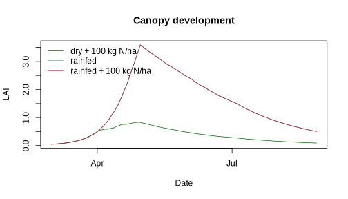
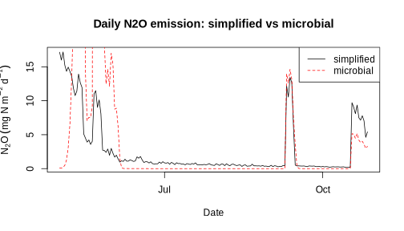

## Overview

This vignette demonstrates the lite model on rice, using the **ponding
module** (v0.5.0+): a real ponded-water layer with daily water balance
(rain + irrigation − infiltration − evaporation − bund overflow),
auto-irrigation to a target depth (`target_mm`), and dissolved-gas
CH4/N2O routed through the floodwater instead of directly to the air.

Three scenarios in a warm summer season: continuous ponding with
fertiliser, rainfed (no irrigation) with fertiliser, and ponding without
fertiliser. The focus is on water/N stress and the yield vs. GHG
trade-off of flooded soils — including methane, which the old
irrigation-hack version of this vignette could not simulate.

## Minimal inputs


``` r
set.seed(21)
n <- 150
weather <- data.frame(
  date   = seq(as.Date("2026-06-01"), by = "day", length.out = n),
  tmax   = 31 + 3 * sin(2 * pi * (1:n) / n) + rnorm(n, 0, 1.5),
  tmin   = 23 + 2 * sin(2 * pi * (1:n) / n) + rnorm(n, 0, 1.2),
  precip = pmax(0, rnorm(n, 2.5, 6))  # sub-humid: rainfed faces dry spells
)
w <- weather_complete(weather, lat_deg = 30, t_base = 8)

soil <- soil_init(depth_mm = c(200, 300, 500),
                  soc = c(1000, 600, 300),   # modest fertility: no-N shows stress
                  nh4_init = 0.3, no3_init = 0.5)
crop <- crop_default_params("rice")
```

## Scenarios


``` r
fert <- data.frame(date = as.Date(c("2026-06-08", "2026-07-10", "2026-08-15")),
                   nh4_add = c(6, 4, 3), no3_add = c(0, 0, 0))

ponded <- list(target_mm = 30, bund_mm = 80)  # keep 30 mm, bund at 80 mm
scenarios <- rbind(
  cbind(spacsys_lite_run(w, soil, crop, n_inputs = fert,
                         ponding = ponded, lat_deg = 30),
        scenario = "ponded + N"),
  cbind(spacsys_lite_run(w, soil, crop, n_inputs = fert,
                         lat_deg = 30),
        scenario = "rainfed + N"),
  cbind(spacsys_lite_run(w, soil, crop, ponding = ponded, lat_deg = 30),
        scenario = "ponded, no N")
)
```

## Ponded-water dynamics


``` r
sub <- scenarios[scenarios$scenario == "ponded + N", ]
plot(sub$date, sub$pond_mm, type = "l", xlab = "Date", ylab = "Ponded depth (mm)",
     main = "Floodwater depth (target 30 mm, bund 80 mm)")
abline(h = c(30, 80), lty = 2, col = "grey")
```



Auto-irrigation holds the layer near 30 mm; storms above the 80 mm bund
overflow as runoff (see `runoff`).

## Canopy and yield


``` r
cols <- c("steelblue", "firebrick", "darkgreen")
matplot(scenarios$date[1:n],
        sapply(split(scenarios$lai, scenarios$scenario), identity),
        type = "l", lty = 1, col = cols, xlab = "Date", ylab = "LAI",
        main = "Rice canopy development")
legend("topleft", legend = levels(factor(scenarios$scenario)),
       col = cols, lty = 1, bty = "n")
```



``` r

tapply(scenarios$w_grain, scenarios$scenario,
       function(x) round(tail(x, 1) / 100, 2))  # t/ha
#>   ponded + N ponded, no N  rainfed + N 
#>         2.94         1.22         2.73
```

## Stress, N uptake and greenhouse gases


``` r
agg <- aggregate(cbind(f_w, f_n) ~ scenario, data = scenarios,
                 FUN = function(x) round(sum(x < 0.9), 0))
names(agg)[2:3] <- c("water_stress_days", "N_stress_days")
agg

tapply(scenarios$n_uptake, scenarios$scenario, sum)  # g N m-2, seasonal
round(tapply(scenarios$n2o, scenarios$scenario, sum) * 10, 2))  # kg N ha-1
round(tapply(scenarios$ch4, scenarios$scenario, sum) * 10, 1)   # kg CH4 ha-1
#> Error in parse(text = input): <text>:7:62: unexpected ')'
#> 6: tapply(scenarios$n_uptake, scenarios$scenario, sum)  # g N m-2, seasonal
#> 7: round(tapply(scenarios$n2o, scenarios$scenario, sum) * 10, 2))
#>                                                                 ^
```

Ponding removes water stress and gives the highest yield. The flooded soil
suppresses N2O (denitrification goes to N2) but produces CH4 — the classic
paddy trade-off, now quantified in one run. Without fertiliser, growth is
N-limited despite ample water.

Caveats: the lite model is a teaching scaffold — simplified
nitrification/denitrification, no iron-plaque/redox chemistry; treat
absolute gas fluxes as illustrative and calibrate before quantitative use.
