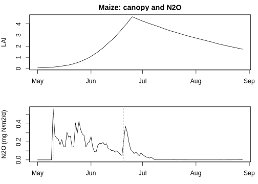

## 1. 这个包是什么

`spacsysr` 是 SPACSYS 模型（Soil-Plant-Atmosphere Continuum System,
Wu 2022 技术手册 v6.00）核心生物地球化学过程的 R 语言实现。
纯 base R、零依赖。注意：它不是 SPACSYS 的完整移植，而是一个
**忠实于手册方程、参数精简的研究/教学脚手架**，每个函数都标注了
手册方程编号和页码。

包里有两条使用路线：

- **独立过程函数**：70+ 个函数，每个对应手册的一个或一组方程，
  可单独调用、单独验证（如 `pet_hargreaves()`、`denitrif_simplified()`、
  `ch4_plant_transport()`）。
- **简化集成模型** `spacsys_lite_run()`：日步长耦合
  土壤水–碳氮–作物生长–温室气体，一次调用得到整个季节的模拟结果，
  输入要求最少。

## 2. 安装


``` r
# 从 GitHub 安装（私有仓库，需要权限）
# remotes::install_github("Chuang2016/spacsysr")
# 或本地安装
# install.packages("spacsysr_0.4.0.tar.gz", repos = NULL, type = "source")
library(spacsysr)
```

## 3. 五分钟快速开始

最小输入只有三样：逐日最高/最低温 + 降水、分层土壤性质、作物类型。


``` r
set.seed(7)
n <- 120
weather <- data.frame(
  date   = seq(as.Date("2026-05-01"), by = "day", length.out = n),
  tmax   = 26 + 4 * sin(2 * pi * (1:n) / n) + rnorm(n, 0, 2),
  tmin   = 16 + 3 * sin(2 * pi * (1:n) / n) + rnorm(n, 0, 1.5),
  precip = pmax(0, rnorm(n, 3, 5))
)
soil <- soil_init(depth_mm = c(200, 300, 500),  # 三层：厚度 mm
                  soc = c(2000, 1200, 600))     # 每层有机碳 g C/m2

out <- spacsys_lite_run(weather, soil,
                        crop = crop_default_params("maize"),
                        lat_deg = 38)
tail(out$w_grain, 1) / 100  # 籽粒产量，t/ha
#> [1] 6.252024
```

`weather_complete()` 会自动补全辐射和 PET：有实测辐射直接用，
有日照时数就用 Angstrom-Prescott 公式（FAO56）推算，
都没有才回退到 Hargreaves 温差法；`soil_init()` 用缺省的田间持水量/萎蔫点等
建好土层。输出 `out` 是日尺度数据框：物候 `dindex`、LAI、
各器官生物量、胁迫因子 `f_t/f_w/f_n`、N2O/NO、CH4、CO2、
淋溶、矿化……共 30 列。

## 4. 加施肥，看氮响应


``` r
n_inputs <- data.frame(
  date    = as.Date(c("2026-05-10", "2026-06-20")),
  nh4_add = c(7, 5),          # g N/m2，施到表层
  no3_add = c(0, 0)
)
out_fert <- spacsys_lite_run(weather, soil,
                             crop = crop_default_params("maize"),
                             n_inputs = n_inputs, lat_deg = 38)
c(no_fert = tail(out$w_grain, 1) / 100,
  fert    = tail(out_fert$w_grain, 1) / 100)
#>  no_fert     fert 
#> 6.252024 6.252024
```

`n_inputs` 的施肥日期会被自动匹配到模拟日历上。

## 5. 温室气体与碳足迹

v0.4.0 起，`spacsys_lite_run()` 直接输出三种温室气体：

- `n2o`：硝化 + 反硝化产生的 N2O（g N/m2/d）
- `ch4`：手册 eq. 210–215 的甲烷模块——厌氧呼吸产甲烷、
  根际/土壤甲烷氧化菌氧化、通气组织传输、逸出（g CH4/m2/d）
- `co2_c / co2_auto_c / co2_total_c`：异养呼吸 + 自养呼吸
  （根/茎叶维持呼吸 + 生长呼吸）的 CO2（g C/m2/d）

`ghg_footprint()` 一键汇总整季碳足迹：


``` r
fp <- ghg_footprint(out_fert)
fp
#>   co2_kg_ha ch4_kg_ha n2o_kg_ha ghg_co2eq_kg_ha share_co2    share_ch4
#> 1  25593.42 0.1698578 0.1577674        25641.23 0.9981354 0.0001848208
#>     share_n2o yield_t_ha intensity_kg_co2eq_per_t_grain
#> 1 0.001679736   6.252024                       4101.268
```

得到每公顷的 CO2、CH4、N2O（kg/ha）、CO2 当量总量、
各气体占比，以及**产量强度**（每吨籽粒的 kg CO2-eq）——
这是碳足迹研究里的标准指标。GWP 默认用 IPCC AR6 的百年值
（CH4=27.9，N2O=273），可用参数换成 AR5 或其他时间尺度。

画一张季节动态图：


``` r
par(mfrow = c(2, 1), mar = c(3, 4, 2, 1))
plot(out_fert$date, out_fert$lai, type = "l", xlab = "", ylab = "LAI",
     main = "Maize: canopy and N2O")
plot(out_fert$date, out_fert$n2o * 1000, type = "l", xlab = "Date",
     ylab = "N2O (mg N/m2/d)")
abline(v = n_inputs$date, lty = 2, col = "grey")
```



## 6. 模块导览：想自己组装流程？

集成模型嫌黑箱？所有过程都是独立函数，可单独调用：


``` r
# 气象：Hargreaves PET、日长、积温
pet_hargreaves(tmax = 28, tmin = 18, lat_deg = 38, doy = 150)
#> [1] 4.984746

# 土壤水：蓄水桶式水平衡（另有 1-D Richards 求解器 soilwater_richards）
w <- soil_water_step(theta = c(0.25, 0.28, 0.30), precip = 12, pet = 5,
                     fc = c(0.3, 0.3, 0.3), wp = c(0.12, 0.12, 0.12),
                     sat = c(0.45, 0.45, 0.45), depth_mm = c(200, 300, 500))
w$aet_mm  # 实际蒸散
#> [1] 5

# 土壤碳氮：双库分解 + 简化硝化/反硝化
s <- soilcn_lite_step(list(c_litter = 100, c_humus = 2000, nh4 = 2, no3 = 4),
                      tsoil = 22, theta_pct = 28, sat_pct = 45,
                      ph = 6.5, depth_m = 0.2)
c(co2 = s$co2_c, n2o = s$n2o, mineralised = s$n_mineralised)
#>         co2         n2o mineralised 
#>  1.95278720  0.00000000  0.01148698

# 作物：RUE 生长（另有 Farquhar C3 / Yin-Struik C4 光合模块）
p0 <- plant_init(crop_default_params("wheat"))
g <- plant_growth_step(p0, rad = 20, tavg = 22, gdd = 14,
                       f_w = 1, n_avail = 5,
                       crop = crop_default_params("wheat"))
c(growth = g$growth, f_n = g$f_n, lai = g$state$lai)
#>     growth        f_n        lai 
#> 0.66946678 1.00000000 0.04915489

# 甲烷：植物传输（手册 eq. 214）
ch4_plant_transport(f_root = 0.5, w_leaf = 80, ch4_con = 5, z = 0.1)
#> [1] 0.01243812
```

完整函数清单见 `?spacsysr` 或 Notion 上的函数速查表（77 个函数）。

## 7. 简化假设（必读）

- lite 模型是**教学/研究脚手架**：桶式水、双库碳、简化硝化/
  反硝化、RUE 生长——参数少，但别拿它做精准预测。
- 甲烷氧化动力学参数（`vr_max` 等）手册没有给默认值，
  包里用的是示意性文献典型值，定量用之前请率定。
- 甲烷模块无积水层、无扩散详细过程；N2O 为简化路径。
- 所有简化都在各函数帮助文档的 `details` 里写明了。

更多案例见 vignette：`lite-wheat`（水×氮）、`lite-rice`
（淹水 vs 雨养）、`lite-maize`（干旱×氮互作）、`n2o-paddy`。
